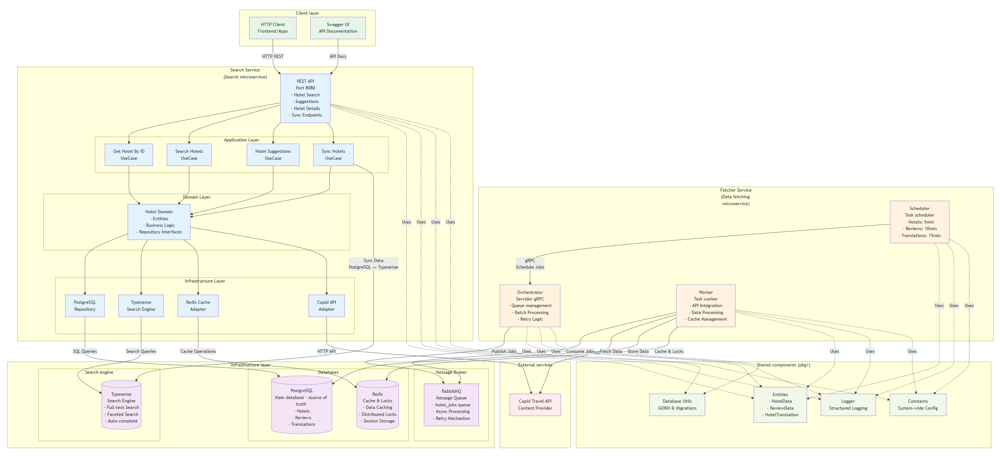

# Hotel Data Management System

A comprehensive hotel data management system built with microservices architecture, implementing Domain-Driven Design (
DDD) principles and hexagonal architecture patterns. The system handles hotel data fetching, processing, and search
operations with high performance and scalability.



## Quick Start

### Essential Commands

To get the application running, execute these three main commands in order:

1. **Setup Environment Configuration**
   ```bash
   make copy-env
   ```
   This command copies `.env.example` to `.env` with all necessary environment variables for database connections, API
   keys, and service configurations.

2. **Start All Services**
   ```bash
   make docker-up
   ```
   Launches the complete system with Docker Compose, including all infrastructure services (PostgreSQL, Redis, RabbitMQ,
   Typesense) and application services (scheduler, orchestrator, search-service) with 3 worker instances by default.

3. **Start Services with Custom Worker Scaling**
   ```bash
   make docker-up-workers N=5
   ```
   Starts the system with a specified number of worker instances for horizontal scaling. Replace `N=5` with your desired
   number of workers based on load requirements.

### API Documentation

Once the services are running, you can access the Swagger API documentation at:

**http://localhost:8080/swagger/index.html**

This interactive documentation provides detailed information about all available endpoints, request/response schemas,
and allows you to test the API directly from your browser.

## Configuration

### Environment Variables (.env)

The system requires several environment variables configured in the `.env` file:

- **Database**: PostgreSQL connection settings (`POSTGRES_HOST`, `POSTGRES_USER`, `POSTGRES_PASSWORD`)
- **Message Queue**: RabbitMQ configuration (`RABBITMQ_HOST`, `RABBITMQ_USER`, `RABBITMQ_PASSWORD`)
- **Caching**: Redis connection parameters (`REDIS_HOST`, `REDIS_PASSWORD`)
- **Search Engine**: Typesense API configuration (`TYPESENSE_API_KEY`)
- **External API**: Cupid Travel API credentials (`CUPID_API_KEY`, `CUPID_API_BASE_URL`)

### Application Configuration (config.yaml)

The `config.yaml` file contains detailed service configurations:

- **Scheduler**: Update intervals for hotels (5min), reviews (10min), and translations (15min)
- **Orchestrator**: Batch processing settings, retry mechanisms, and gRPC server configuration
- **Worker**: Database connections, queue settings, TTL configurations for caching and locks
- **Search Service**: Server timeouts, database pools, Redis caching, and Typesense integration
- **Sync Settings**: Batch sizes, sync intervals, and concurrent worker limits

## Load Testing

### K6 Performance Testing

The system includes comprehensive load testing capabilities using K6:

```bash
# Install K6 testing tool
make k6-install

# Run full load test for hotel-by-id endpoint
make k6-test-hotel-id

# Run quick 2-minute load test
make k6-test-hotel-id-quick
```

The load test configuration includes:

- **Load Patterns**: Ramp-up from 10 to 100 concurrent users over 15 minutes
- **Performance Thresholds**: 95th percentile response time under 500ms, error rate below 1%
- **Test Scenarios**: Hotel retrieval with 100 different hotel IDs
- **Metrics**: Response time trends, error rates, and throughput measurements

### HTTP Request Testing

For manual testing and hotel data loading, you can execute the HTTP requests file:

**test/http/hotel-by-id-requests.http**

This file contains a collection of GET requests for multiple hotel IDs that can be used to load and test hotel data
retrieval. The file includes requests for various hotel endpoints and can be executed using HTTP client tools or IDE
extensions that support .http files.

## System Architecture

### Architecture Diagrams

The `diagrams` directory contains visual representations of the system architecture:

- **architecture-overview.png**: Global architecture diagram
- **fetcher-service-architecture.png**: Overall architecture diagram of the fetcher service components
- **fetcher_service_flow_diagram.svg**: Detailed flow diagram showing data processing workflow
- **hotel_api_request_flow.png**: API request flow diagram illustrating the hotel data retrieval process

### High-Level Architecture

The system follows a **microservices architecture** with clear separation of concerns:

1. **Fetcher Service**: Handles data acquisition and processing
    - **Scheduler**: Manages periodic data fetch operations using configurable intervals
    - **Orchestrator**: Coordinates job distribution and manages worker queues via gRPC
    - **Worker**: Processes individual hotel data requests, handles API calls, caching, and database operations

2. **Search Service**: Provides fast hotel search and retrieval capabilities
    - **API Layer**: RESTful endpoints for hotel search and retrieval
    - **Search Engine**: Typesense integration for full-text search and filtering
    - **Caching Layer**: Redis-based caching for improved performance

3. **Infrastructure Components**:
    - **PostgreSQL**: Primary data storage for hotels, reviews, and translations
    - **Redis**: Caching layer and distributed locking mechanism
    - **RabbitMQ**: Message queue for asynchronous job processing
    - **Typesense**: Search engine for fast hotel discovery and filtering

### Database Design

The system uses multiple specialized databases:

- **PostgreSQL**: Relational data storage for structured hotel information
- **Redis**: Key-value store for caching and session management
- **Typesense**: Document store optimized for search operations

## Domain-Driven Design (DDD) and Ports & Adapters

### DDD Implementation

The codebase demonstrates strong Domain-Driven Design principles:

1. **Domain Layer**: Core business logic isolated from infrastructure concerns
    - **Entities**: Hotel, Review, Translation domain objects
    - **Value Objects**: Immutable data structures representing business concepts
    - **Domain Services**: Business operations that don't naturally belong to entities

2. **Application Layer**: Use cases and application services
    - **Use Cases**: `SearchHotels`, `GetHotelById`, `SyncHotels`, `GetHotelSuggestions`
    - **Application Services**: Coordinate between domain and infrastructure

3. **Infrastructure Layer**: External concerns and technical implementations
    - **Repositories**: Data persistence implementations
    - **Adapters**: External API integrations and third-party services

### Ports & Adapters (Hexagonal Architecture)

The system implements hexagonal architecture through well-defined interfaces:

**Ports (Interfaces)**:

- `APIClientPort`: External API communication contract
- `Repository`: Data persistence abstraction
- `CacheRepository`: Caching operations interface
- `Provider`: Data provider abstraction

**Adapters (Implementations)**:

- `CupidAPIAdapter`: Cupid Travel API integration
- `PostgresHotelRepository`: PostgreSQL data persistence
- `RedisCache Adapter`: Redis caching implementation
- `TypesenseAdapter`: Search engine integration

This architecture ensures:

- **Testability**: Easy mocking and unit testing
- **Flexibility**: Swappable implementations without business logic changes
- **Maintainability**: Clear separation of concerns and dependencies

## Future Improvements Checklist

### Testing Enhancements

- [ ] **Integration Testing**: Implement comprehensive integration tests covering service interactions
- [ ] **Testcontainers**: Add containerized testing for database and external service dependencies
- [ ] **Extended K6 Testing**: Create additional load test scenarios for search endpoints and concurrent operations
- [ ] **Chaos Engineering**: Implement fault injection testing to verify system resilience

### Infrastructure Scaling

- [ ] **Kong API Gateway**: Implement Kong Gateway for centralized API management, authentication, rate limiting, and
  request/response transformation
- [ ] **Nginx Load Balancer**: Add Nginx load balancer for the exposed API to distribute traffic across multiple service
  instances
- [ ] **Typesense Coordination**: Implement Typesense cluster coordination for high availability
- [ ] **Database Sharding**: Add PostgreSQL sharding strategies for horizontal scaling
- [ ] **Load Balancing**: Implement proper load balancing for multiple service instances
- [ ] **Service Mesh**: Consider service mesh implementation for advanced traffic management

### Performance Optimization

- [ ] **Advanced Caching**: Implement multi-level caching strategies with cache warming
- [ ] **Connection Pooling**: Optimize database connection pooling configurations
- [ ] **Async Processing**: Expand asynchronous processing capabilities for non-critical operations
- [ ] **Query Optimization**: Implement database query optimization and indexing strategies

### Feature Enhancements

- [ ] **AI Integration**: Use AI for intelligent tags, suggestions, trending recommendations, and personalized content
- [ ] **Enhanced Search Results**: Complete Typesense search results with additional information from PostgreSQL
  database
- [ ] **Search API Extensions**: Implement facets and suggestions endpoints for advanced search functionality

### Monitoring and Observability

- [ ] **Distributed Tracing**: Add comprehensive tracing across all service interactions
- [ ] **Metrics Collection**: Implement detailed business and technical metrics
- [ ] **Health Checks**: Enhanced health check endpoints for all services
- [ ] **Alerting System**: Comprehensive alerting for critical system events

### Security Improvements

- [ ] **API Authentication**: Implement proper authentication and authorization mechanisms
- [ ] **Rate Limiting**: Add rate limiting for API endpoints
- [ ] **Data Encryption**: Encrypt sensitive data at rest and in transit
- [ ] **Security Scanning**: Regular security vulnerability assessments

### Development Experience

- [ ] **API Documentation**: Expand Swagger/OpenAPI documentation
- [ ] **Development Tools**: Additional debugging and profiling tools
- [ ] **CI/CD Pipeline**: Comprehensive continuous integration and deployment setup
- [ ] **Environment Management**: Streamlined environment provisioning and management